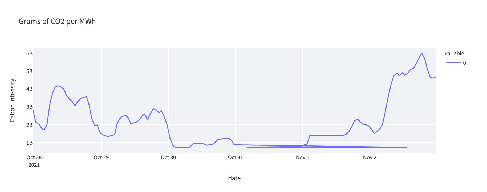
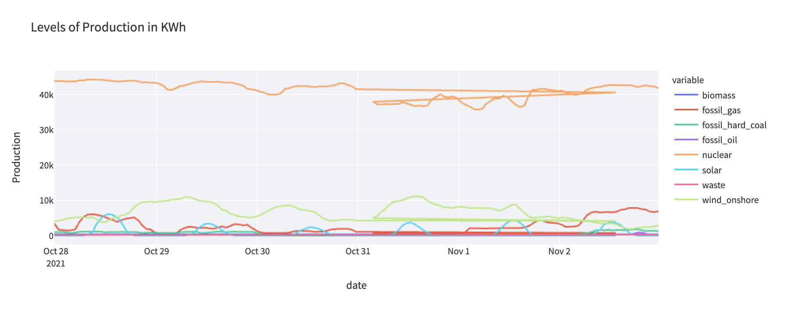
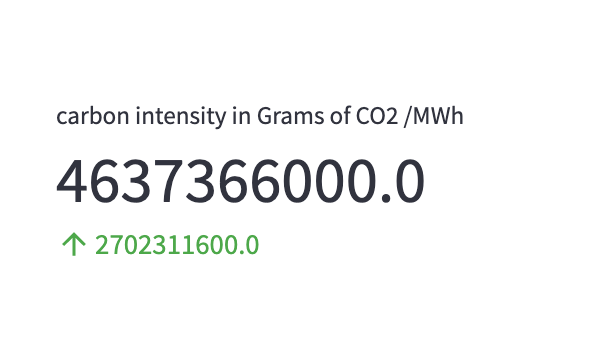

# Projet Data RTE

## Données
Les données viennent de l'API "Actual Generation" de RTE qui sont accessibles via le protocol Oauth2, et mise à jour toutes les heures 
https://data.rte-france.com/catalog/-/api/generation/Actual-Generation/v1.1?fbclid=IwAR04Vwn0ixY3z9eauJufcl-CYQpLW6MMyk3wmXboTpyPXmGpEkXFjOW5bTM

## Architecture 
Comme nous souhaitons réaliser un projet type dashbord, j'ai choisit le framework python [Streamlit](https://streamlit.io/) (Flask) permettant de développer un serveur rapidement sans se soucier de la structure html/css. Le code va donc requêter toutes le 5 minutes le site de RTE pour actualiser les courbes.

## Captures d'écran
### courbe des emmissions de co2 de la semaine passée

### courbes de la décomposition de la production de la semaine passée


### indicateur de comparaison des emissions par rapport à la moyenne de la semaine passé 


## lancer l'application
```
pip install -r requirements.txt
streamlit run rte_app.py
```
ouvrir la page : http://localhost:8501

## Problèmes à corriger / Améliorations
* Le passage du mois d'Octobre au mois de Novembre a clairement généré une erreur dans les dates
* Il existe un problème de Threads dans l'application, message d'erreur suivant : ``` NumExpr defaulting to 8 threads ``` 
* Utiliser une autre architecture (Django ?) pour pouvoir mettre à disposition une API Rest
